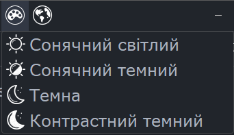
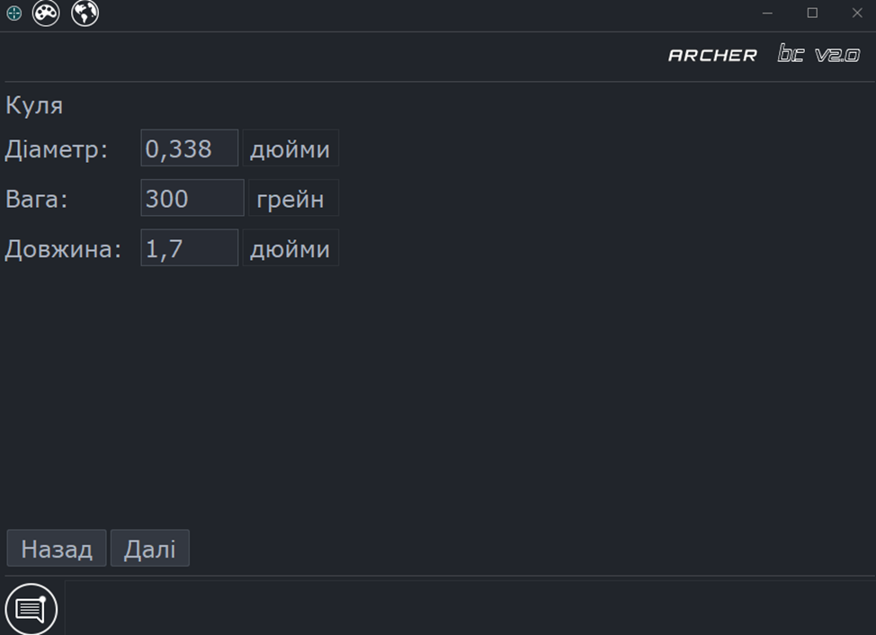

# Введення
**Додаток використовується для створення і редагуванння балістичних профілів для\
**Тепловізійних стрілецьких прицільних комплексів ARCHER.**\
Додаток використовує спеціально розроблений формат файлів `.a7p` який підтримується найновішими приладами Archer.**

## Зміст
* **[Діалог запуску](#start-dialog)**
* **[Налаштування](#app-settings)**
* **[Створення балістичного профілю](#creation-wizard)**
* **[Редагування профілю](#profiles-editor)**
  * [Верхня панель](#top-bar-actions)
  * [Вкладки бокової панелі](#side-bar-tabs)
* **[Дерево файлів](#device-files-tree)**
* **[Використання Мульти-БК](#multibc-usage)**

##  Діалог запуску 

Під час запуску програми виберіть необхідний варіант із випадаючого списку **«Створити»** або **«Відкрити»** і натисніть **«Ок»**.
В залежності від вибору відкриється або **[Майстер створення профілю](#creation-wizard)** або **діалог вибору файлу** 

##  Налаштування 

*  - Вибір мови

*  - Вибір теми

##  Майстер створення балістичного профілю 
### При виборі опції `Створити` запускається `Майстер створення нового профілю` 
Нижче описані кроки для створення `.a7p` файлу профілю

####  1. Опис профілю 
З першу треба заповнити назви профілю, патрону, кулі і натиснути `Далі`. Ця інформація буде відображатись в меню `Гвинтівки` приладу.

####  2. Вкажіть параметри рушниці 

**Вкажіть такі параметри:**
* Калібр ствола - *можна ввести вручну або скористатись кнопкою `Вибрати`*
* Крок нарізів (Твіст)
* Напрямок нарізів
* Висота прицілу

####  3. Вкажіть параметри набою 

**Вкажіть такі параметри:**
* Температура пороху
* Базова швидкість при вказаній температурі
* Коефіцієнт температурної чутливості пороху

####  4. Вкажіть фізичні розміри і вагу кулі 

####  5. Виберіть діапазон дистанцій 

Оберіть діапазон робочих дистанцій відповідно до ваших потреб із запропонованих варіантів
Ці дистанції будуть доступні у при виборі поточної дистанції в інтерфейсі приладу

####  6. Драг-модель і балістичний коефіцієнт 
**В наступних кількох пунктах потрібно обрати:**
* Тип Драг-моделі (G1 або G7)

* Який тип балістичного коефіцієнту використовувати - усереднений БК (Single) або мульти-БК

* В залежності від обраного типу БК введіть:
  * Усереднений бк
  
  * Або таблицю мульти-БК для різних швидкостей
  

####  7. Збереження профілю 
Програма запропонує зберегти щойно створений профіль до файлу, оберіть місце збереження і натисніть `Save`.
На цьому етапі профіль вважається створеним і буде відкритий в [редакторі](#profiles-editor), мова про який йде в наступному розділі

##  Profiles editor 

...........

###  Top-bar actions 

*  Create new
*  Open 
*  Save 
*  Save as 
*  Reload 
*  Import zeroing 
*  Import to JSON 
*  Export to JSON

###  Sidebar tabs 

*  Profile description
*  Rifle properties
*  Cartridge data
*  Bullet data and Drag Model
*  Zeroing
*  File tree

##  Device files tree 
...........

##  MultiBC usage 
...........
