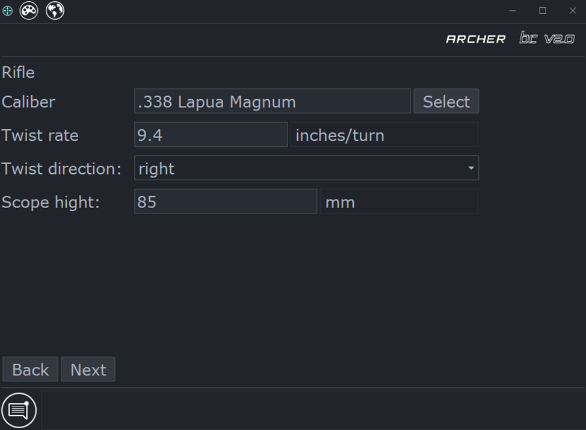
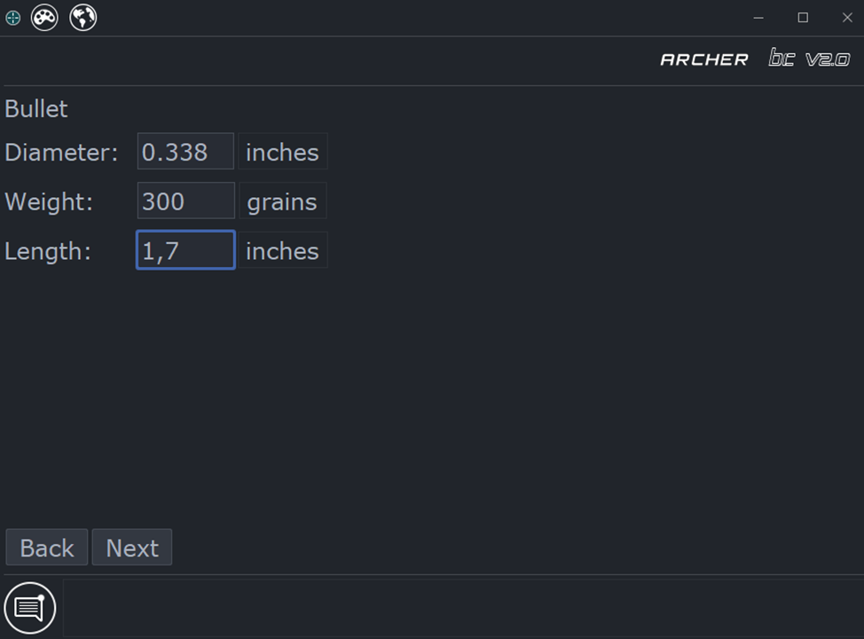
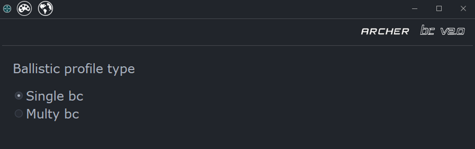
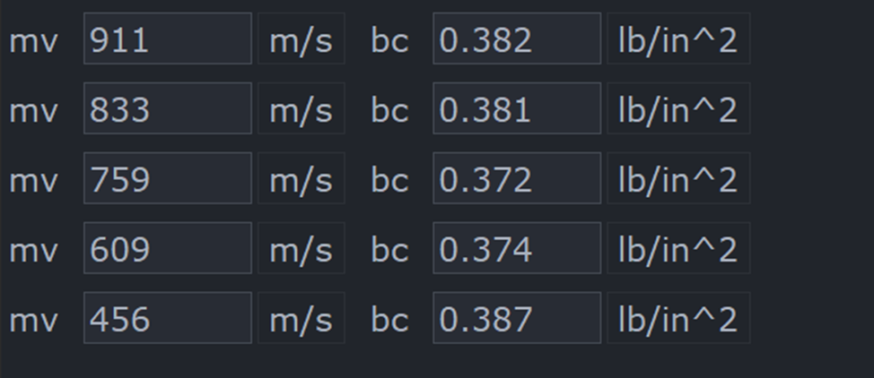
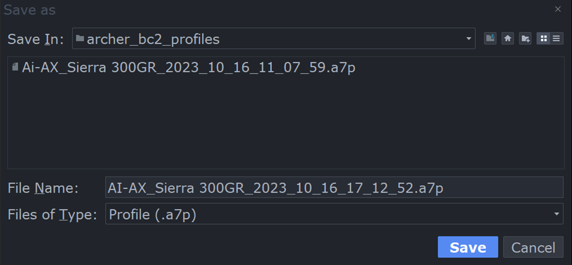
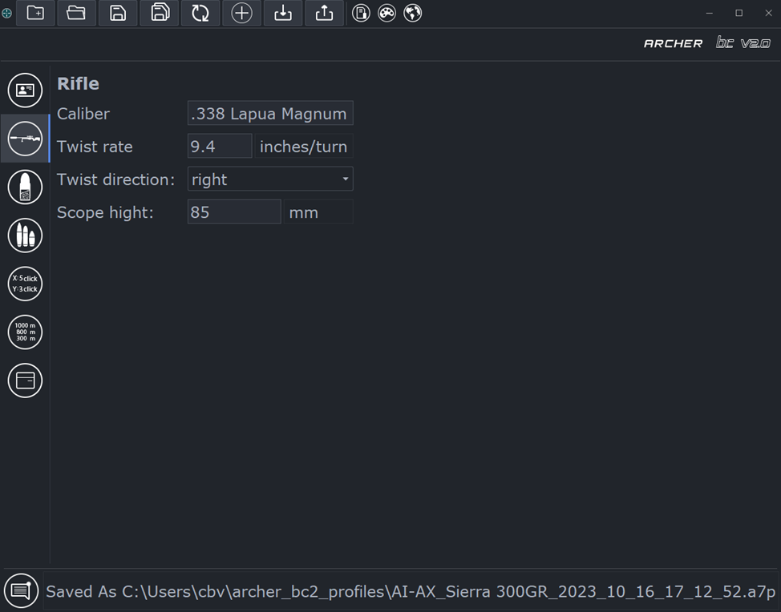
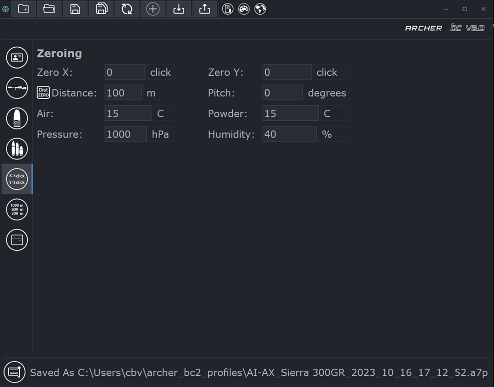
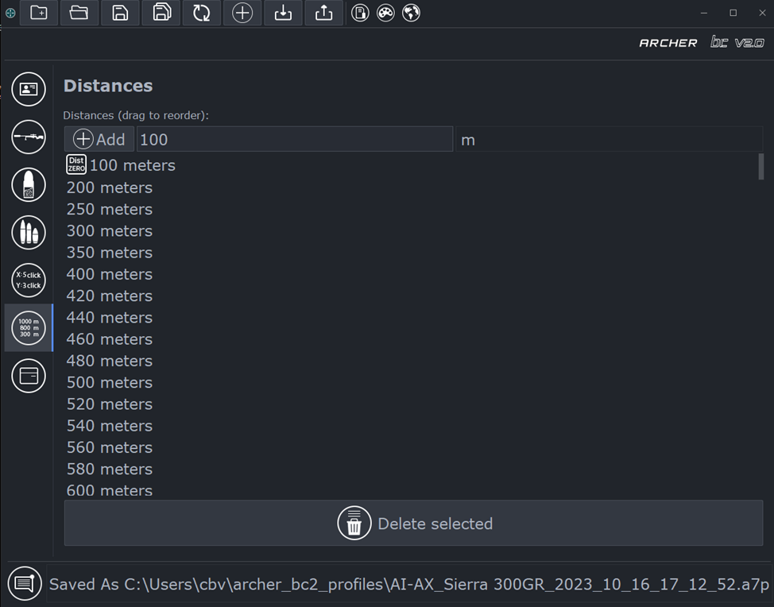

# ArcherBC2 - USER GUIDE

## Intro
**The app is using to create and edit ballistic profiles for an \
**ARCHER THERMAL IMAGING SIGHTING SYSTEMS.**\
App uses special files format `.a7p` that supports by newest Archer devices.**

## Tabel of contents
* **[Start dialog](#start-dialog)**
* **[Settings](#app-settings)**
* **[Create ballistics profile](#creation-wizard)**
  * [Description](#wizard-desc)
  * [Rifle](#wizard-rifle)
  * [Cartridge](#wizard-cart)
  * [Bullet](#wizard-bullet)
  * [Distances set](#wizard-dist)
  * [Ballistic coefficient](#wizard-dm)
  * [Save dialog](#wizard-save)
* **[Ballistic profile editor](#profiles-editor)**
  * [Top-bar actions](#top-bar-actions)
  * [Sidebar tabs](#sidebar-tabs)
* **[Powder temperature sensitivity](#powder-sens)**
* **[FAQ](#faq)**
  * [App doesn't start or update not success](#app-run-issue)

## <span id="start-dialog"> Start dialog </span>

When starting the program, select the required option **"Create"** or **"Open"** and click **"Ok"**.
Depending on the choice, either **[Profile creation wizard](#creation-wizard)** or **file selection dialog** will open


## <span id="app-settings"> Settings </span>

*  - Language selection


*  - Theme selection


## <span id="creation-wizard"> Profile creation wizard </span>
### When you select the `Create` option, the `Profile Creation Wizard` starts
The steps to create an `.a7p` profile file are bellow

#### <span id="wizard-desc"> 1. Description </span>
Firstly, you need to fill in the `names of the profile, cartridge and bullet`, after click `Next`. This information will be displayed in the `Rifles` menu of the device.


#### <span id="wizard-rifle"> 2. Rifle parameters </span>

**Set the following parameters:**
* Barrel caliber - *can be entered manually or use the `Select` button*
* Twist
* Twist direction
* Sight height



#### <span id="wizard-cartridge"> 3. Specify the cartridge parameters </span>

**Set the following parameters:**
* Powder temperature
* Base speed at the specified temperature
* [Coefficient of powder temperature sensitivity](#powder-sens)


#### <span id="wizard-bullet"> 4. Set the physical dimensions and weight of the bullet </span>



#### <span id="wizard-dist"> 5. Choose a range of distances </span>

Choose the `range of working distances` according to your needs from the options offered
These distances will be available when selecting the current distance in the device interface


#### <span id="wizard-dm"> 6. Drag model and ballistic coefficient </span>
**In the following few points you need to choose:**
* Drag model `(G1 or G7)`


* Type of ballistic coefficient to use - `average BC (Single) or multi-BC`


* Depending on the selected BC type, enter:
  * Average BC
  
  * Or a multi-BC table for different speeds
  

#### <span id="wizard-save"> 7. Save profile </span>
The program will offer to save the newly created profile to a file, choose a storage location and click `Save`.
At this stage, the profile is considered created and will be opened in the [editor](#profiles-editor), which is discussed in the next section


## <span id="profiles-editor"> Ballistic profiles editor </span>
The editor opens immediately after creating a new profile, or when opening a profile from a `.a7p` file

### <span id="top-bar-actions"> Top-bar actions </span>

* 
  Create - opens [profile creation wizard](#creation-wizard)
* 
  Open - opens a file selection dialog
* 
  Save - saves changes to the currently open file
* 
  Save as - opens a dialog for choosing a location to save the file
* 
  Reload - restores data from the currently open file
* 
  Import zeroing - allows you to download a zeroing from another file to the current one 
* 
  import ballistic profile from JSON
* 
  export ballistic profile to JSON

### <span id="sidebar-tabs"> Sidebar tabs </span>
The sidebar tabs allow you to edit the ballistic parameters according to the sections
* ** Description**
  
  Here you can edit and change the `description of the ballistic profile`, this data will be displayed in the `Rifles` menu of the device \
  You can also change `the short names for the profile icon` (Options `Top` and `Bottom`)
  or add a note to the current profile \
  

* ** Rifle**
  
  The `Rifle` tab contains information about the `caliber`, `sight height`, `barrel twist` and `twist direction` \
  
  
* ** Cartridge**

  In the `Cartridge` tab, you can change the `muzzle velocity`, `temperature`, or `sensitivity of powder`
  

* ** Bullet, Drag-model and BC**

  In the `Bullet` tab, you can edit the `bullet's physical parameters`, change the `drag model type`, specify a `custom drag function`, create a `multi-BC table`
  

* ** Zeroing**

  
  The `Shooting` tab displays:
  * `current profile zeroing`
  * `zeroing atmosphere`

  These data are `saved in the profile automatically when aiming` the device 
  

* ** Distances**

  Here you can edit the `working distances set` for the current profile
  

* ** Files tree**

  The File Tree tab displays:
  * a list of profiles in the program repository
  * connected devices and profiles in their flash drives  
  

## <span id="powder-sens"> Powder temperature sensitivity </span>
The coefficient of temperature dependence `TC' of powder is calculated according to the formulas below:
```
T2 і V2                           - lower temperature and lower speed respectively
ΔT = |T1 - T2|                    - temperature difference in ºС
ΔV = |V1 - V2|                    - difference in muzzle velocities for the indicated temperatures in m/c
TC = ΔV / ΔT * (15 / Vl) * 100    - powder temperature sensitivity coefficient in %/15ºС
```
**Important!** To obtain an accurate coefficient of temperature sensitivity of gunpowder, the temperature difference must be more than 10ºС

## <span id="faq"> FAQ </span>

### <span id="app-run-issue"> App doesn't start or update not success </span>
* Windows:
  * Delete the app instance through the `Start` -> `Settings` -> `Programs and features` -> `ArcherBC2` -> `Delete`
  * [Download the latest update here](https://github.com/JAremko/ArcherBC2/releases/latest)
  * Install downloaded package