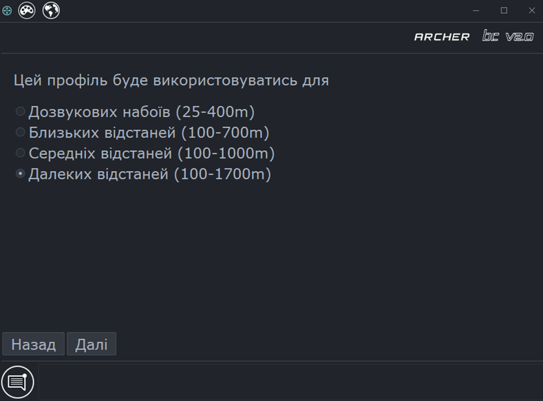
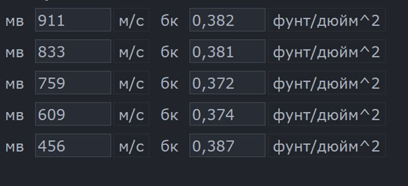

# ArcherBC2 - Керівництво користувача

## Введення
**Додаток використовується для створення і редагуванння балістичних профілів для\
**Тепловізійних стрілецьких прицільних комплексів ARCHER.**\
Додаток використовує спеціально розроблений формат файлів `.a7p` який підтримується найновішими приладами Archer.**

## Зміст
* **[Діалог запуску](#start-dialog)**
* **[Налаштування](#app-settings)**
* **[Створення балістичного профілю](#creation-wizard)**
  * [Опис профілю](#wizard-desc)
  * [Рушниця](#wizard-rifle)
  * [Набій](#wizard-cart)
  * [Куля](#wizard-bullet)
  * [Робочі дистанції](#wizard-dist)
  * [Баллістичний коефіцієнт](#wizard-dm)
  * [Збереження профілю](#wizard-save)
* **[Редактор балістичних профілів](#profiles-editor)**
  * [Верхня панель](#top-bar-actions)
  * [Вкладки бокової панелі](#sidebar-tabs)
* **[Температурна залежність пороху](#powder-sens)**
* **[Поширені запитання](#faq)**
  * [Додаток не запусакється або не оновлюється](#app-run-issue)

## <span id="start-dialog"> Діалог запуску </span>

Під час запуску програми виберіть необхідний варіант **«Створити»** або **«Відкрити»** і натисніть **«Ок»**.
В залежності від вибору відкриється або **[Майстер створення профілю](#creation-wizard)** або **діалог вибору файлу** 


## <span id="app-settings"> Налаштування </span>

*  - Вибір мови


*  - Вибір теми


## <span id="creation-wizard"> Майстер створення балістичного профілю </span>
### При виборі опції `Створити` запускається `Майстер створення нового профілю` 
Нижче описані кроки для створення `.a7p` файлу профілю

#### <span id="wizard-desc"> 1. Опис профілю </span>
З першу треба заповнити назви профілю, патрону, кулі і натиснути `Далі`. Ця інформація буде відображатись в меню `Гвинтівки` приладу.


#### <span id="wizard-rifle"> 2. Вкажіть параметри рушниці </span>

**Вкажіть такі параметри:**
* Калібр ствола - *можна ввести вручну або скористатись кнопкою `Вибрати`*
* Крок нарізів (Твіст)
* Напрямок нарізів
* Висота прицілу


#### <span id="wizard-cartridge"> 3. Вкажіть параметри набою </span>

**Вкажіть такі параметри:**
* Температура пороху
* Базова швидкість при вказаній температурі
* [Коефіцієнт температурної чутливості пороху](#powder-sens)


#### <span id="wizard-bullet"> 4. Вкажіть фізичні розміри і вагу кулі </span>


#### <span id="wizard-dist"> 5. Виберіть діапазон дистанцій </span>

Оберіть діапазон робочих дистанцій відповідно до ваших потреб із запропонованих варіантів
Ці дистанції будуть доступні у при виборі поточної дистанції в інтерфейсі приладу



#### <span id="wizard-dm"> 6. Драг-модель і балістичний коефіцієнт </span>
**В наступних кількох пунктах потрібно обрати:**
* Тип Драг-моделі (G1 або G7)


* Який тип балістичного коефіцієнту використовувати - усереднений БК (Single) або мульти-БК


* В залежності від обраного типу БК введіть:
  * Усереднений бк
  
  * Або таблицю мульти-БК для різних швидкостей
  

#### <span id="wizard-save"> 7. Збереження профілю </span>
Програма запропонує зберегти щойно створений профіль до файлу, оберіть місце збереження і натисніть `Save`.
На цьому етапі профіль вважається створеним і буде відкритий в [редакторі](#profiles-editor), мова про який йде в наступному розділі


## <span id="profiles-editor"> Редактор балістичних профілів </span>
Редактор відкривається одразу після створення нового профілю, або при відкритті профілю із `.a7p` файлу

### <span id="top-bar-actions"> Верхня панель </span>

* 
  Створити - викликає [майстер створення нового профілю](#creation-wizard)
* 
  Відкрити - відкриває діалог вибору файлу
* 
  Зберегти - зберігає зміни до поточного відкритого файлу
* 
  Зберегти як - відкриває діалог для вибору місця збереження файлу
* 
  Перезавантажити - відновлює дані з поточного відкритого файлу 
* 
  Імпорт пристрілки - дозволяє завантажити пристрілку з іншого файлу до поточного 
* 
  імпорт балістичного профілю з JSON 
* 
  експорт балістичного профілю в JSON

### <span id="sidebar-tabs"> Вкладки редактора </span>
Вкладки бокової панелі надають можливість редагування балістичних параметрів відповідно до розділів 
* ** Опис профілю**
  
  Тут можна редагувати та змінювати `опис балістичного профілю`, ці дані відображатимуться в меню `Гвинтівки` приладу \
  Також можна змінити `короткі назви для іконки профілю` (Параметри `Верх` і `Низ`)
  або додати нотатку до поточного профілю \
  

* ** Гвинтівка**
  
  Вкладка `Гвинтівка` вміщує дані про `калібр`, `висоту прицілу`, `крок нарізів і їх напрямок` \
  
  
* ** Набій**

  У вкладці `Набій` можна змінити `початкову швидкість`, `тeмпературу` або `чутливість пороху`
  

* ** Куля, Драг-модуль і Балістичний коефіцієнт**

  У вкладці `Куля` можна відредагувати `фізичні параметри кулі`, змінити `тип драг-моделі`, вказати `спеціальну (кастомну) драг-функцію`, створити `таблицю мульти-БК`
  

* ** Пристрілка**

  Вкладка `Пристрілка` відображає:
  * поточну пристрілку профілю
  * атмосферу пристрілки

  Ці дані зберігаються у профіль автоматично під час пристрілки приладу  
  

* ** Дистанції**
  
  Тут можна відредагувати `список робочих дистанцій` для поточного профілю
  

* ** Дерево файлів**

  Вкладка `Дерево файлів` відображає:
  * перелік профілів у сховищі програми
  * підключені прилади і профілі в на їх флеш накопичувачах
  

## <span id="powder-sens"> Температурна залежність пороху </span>
Коефіцієнт температурної залежності `TC` пороху розраховується за формулами:
```
T2 і V2                          - нижча температура і нижча швидкість відповідно
ΔT = |T1 - T2|                   - різниця температур ºС
ΔV = |V1 - V2|                   - різниця початкових швидкостей для вказаних температур м/c
TC = ΔV / ΔT * (15 / Vl) * 100   - коефіцієнт температурної чутливості %/15ºС
```
**Важливо!** Для отримання точного коефіцієнту температурної чутливості пороху різниця температур має бути більше 10ºС

## <span id="faq"> Поширені запитання </span>

### <span id="app-run-issue"> Додаток не запусакється або не оновлюється </span>
* Windows:
  * Видаліть поточну інсталяцію додатку `Start` -> `Налаштування` -> `Програми та функцыъ` -> `ArcherBC2` -> `Видалити`
  * [Завантажте останнє оновлення тут](https://github.com/JAremko/ArcherBC2/releases/latest)
  * Встановіть завантажене оновлення